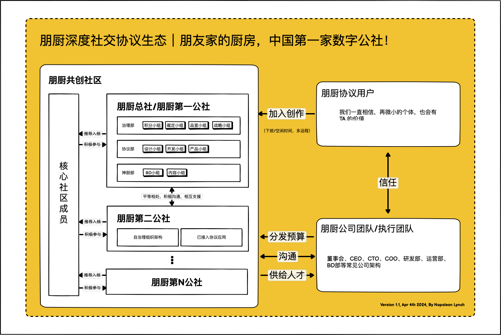

# 三、朋厨生态架构

朋厨生态由各个认证朋厨公社构成，每个公社带有正整数编号，一号公社为朋厨总社，后续公社为朋厨分社。每个公社可以根据自己社内情况设定组织架构。

<figure><figcaption></figcaption></figure>

朋厨总社分为治理部、神厨部和协议部三个部分。

* 治理部负责对三大部人员工作、贡献认定、人员分配、利益分配等事务进行管理，总体发展战略进行建言与管理；
* 神厨部负责为朋厨产品与协议提供高质量内容创作，合作方对接与关系维护；
* 协议部负责对已有产品、协议进行设计、建议；对与强相关的技术业务提供开发和运维支持；对活动与产品进行高质量设计工作，用户沟通与反馈；

积分小组：是目前（第一期）治理部唯一的下辖小组，由五个人组成，该小组将主要负责起本期治理部所有职责。该小组实行3/5与4/5 决策制，即五人各持有一票，对该小组的事务进行投票表决，对于普通决策，需达到3票赞同可执行；重大决策，需达到4票赞同可执行。

核心社区成员/核心小组：名称起源于海外互联网3.0自治组织常用名词。朋厨第一期由十位成员构成，负责在架构仍然大幅调整的早期承担三大部的所有职责。同时，在第一期全体核心人员将会辅助积分小组完成治理部工作。
